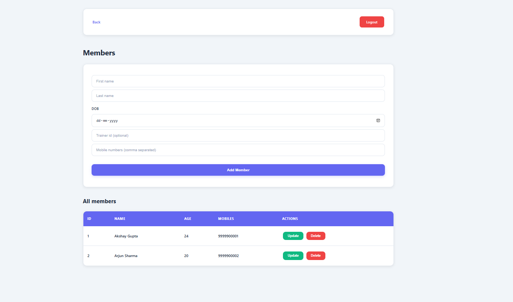
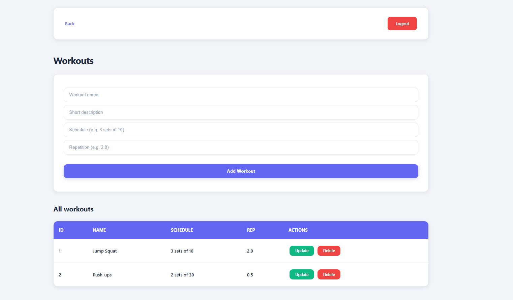

# The CLUSTER — Gym Management System

**The CLUSTER** is a web-based gym management system designed to help fitness centers manage their operations digitally — including gyms, members, trainers, workouts, and enrollments — all from a single admin dashboard.

It replaces manual record-keeping with an organized, searchable, and easy-to-use system.

---

##  Key Features

- **Admin Dashboard** — Centralized control panel for all management tasks  
- **Gym Management** — Manage multiple gym locations and their details  
- **Member Management** — Track member profiles, age, trainer assignments, and contact info  
- **Trainer Management** — Maintain trainer availability, timings, and mobile numbers  
- **Workout Programs** — Create and assign workout plans with schedules and repetitions  
- **Enrollment Tracking** — Track which members are enrolled in which workouts  
- **Secure Login** — Admin authentication with session management  
- **Responsive UI** — Works well on desktop, tablet, and mobile  

---

## Tech Stack

- Node.js, Express.js  
- MySQL  
- HTML, CSS, JavaScript  

---

## Screenshots

### Dashboard

### Member Management

### Workout Programs

---

## Use Case

Designed for:
- Gym owners
- Fitness center administrators
- Small and medium fitness businesses

---

Made with ❤️ by **Tnisha Garg**

